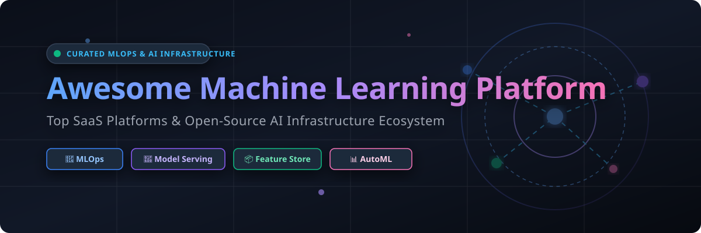

  
  
  
  
  
  

  

# 🚀 Awesome Machine Learning Platform Ecosystem

> **A curated, comprehensive directory of Enterprise SaaS Machine Learning Platforms, Open-Source MLOps Infrastructure, Feature Stores, Experiment Tracking, Model Serving, and AutoML Tools.**

---

## 📌 Keywords & SEO Metadata
`MLOps` · `Machine Learning Platform` · `AI Infrastructure` · `Model Serving` · `Feature Store` · `Experiment Tracking` · `AutoML` · `Kubeflow` · `MLflow` · `SageMaker` · `Vertex AI` · `Data annotation` · `Self-Hosted AI`

---

## 📅 Last Updated: October 2026

This repository tracks notable **commercial machine learning platforms** and **open-source projects** covering the full ML lifecycle — from data prep and experiment tracking to model deployment, monitoring, and governance — without vendor lock-in.

---

## 📑 Table of Contents
- [📊 Market Insights & Sector Fragmentation](#-market-insights--sector-fragmentation)
- [🏢 SaaS & Hosted ML Platforms](#-saas--hosted-ml-platforms)
- [⚡ Open-Source GitHub Projects](#-open-source-github-projects)
  - [🌐 End-to-End MLOps & Orchestration](#-end-to-end-mlops--orchestration)
  - [📊 Experiment Tracking & Model Registry](#-experiment-tracking--model-registry)
  - [🧠 Distributed Computing & Training](#-distributed-computing--training)
  - [📦 Feature Stores & Data Versioning](#-feature-stores--data-versioning)
  - [🚀 Model Serving & Inference Infrastructure](#-model-serving--inference-infrastructure)
  - [⚡ AutoML & Model Optimization](#-automl--model-optimization)
  - [🏷️ Data Annotation & Labeling](#-data-annotation--labeling)
- [⭐ Star History](#-star-history)
- [🤝 How to Contribute](#-how-to-contribute)
- [💖 Support & Community](#-support--community)
- [⚖️ Disclaimer](#%EF%B8%8F-disclaimer)

---

## 📊 Market Insights & Sector Fragmentation

> 📈 **Market Size Estimate**: The global Machine Learning & MLOps Platform market size is estimated at **~$35.4 Billion in 2026** and is projected to expand to over **~$120 Billion by 2030** (CAGR ~32.5%).  
> 🧩 **Sector Fragmentation**: The sector is **moderately fragmented** between hyper-scaler cloud providers (AWS, Azure, Google Cloud) holding dominant compute market share, and specialized enterprise AI platform providers (Databricks, DataRobot, Dataiku, Domino Data Lab) competing fiercely on multi-cloud neutrality, automated governance, and developer productivity.

---

## 🏢 SaaS & Hosted ML Platforms

Below is a curated list of top commercial ML platforms, sorted by **Company Size / Valuation / Revenue** in descending order.

| 🏢 Platform | 💰 Company Valuation / Revenue | 💵 Starting Price | 🎁 Free Tier / Trial Limit | 🎯 Key Features & Best For |
| :--- | :--- | :--- | :--- | :--- |
| **[Microsoft Azure Machine Learning](https://azure.microsoft.com/en-us/products/machine-learning/)** | ~$3.1 Trillion Market Cap *(Azure ~$75B/yr)* | `$0.096/hour` *(Standard_DS1_v2 compute)* | `$200 free credit` (30 days) + 12 months free services | Enterprise ML platform with deep Azure OpenAI integration & Enterprise Agreements. Best for Microsoft-first enterprises. |
| **[Google Cloud Vertex AI](https://cloud.google.com/vertex-ai)** | ~$2.1 Trillion Market Cap *(GCP ~$40B/yr)* | `$0.045/hour` *(n1-standard-1 node)* | `$300 free credit` (90 days) for new GCP accounts | Unified ML platform deeply tied into BigQuery, AutoML, and custom pipeline tools. Best for data-heavy teams. |
| **[Amazon SageMaker](https://aws.amazon.com/sagemaker/)** | ~$1.95 Trillion Market Cap *(AWS ~$105B/yr)* | `$0.05/hour` *(ml.t3.medium notebook)* | 2-Month Free Tier *(250h notebook, 50h training, 125h hosting/mo)* | AWS fully managed ML platform covering data labeling, training, tuning, and hosting. Best for AWS-native orgs. |
| **[Databricks Machine Learning](https://www.databricks.com/)** | ~$43 Billion Valuation *($1.6B+ ARR)* | `$0.07/DBU` *(Databricks Unit serverless compute)* | 14-Day Free Trial *(Full workspace access on cloud of choice)* | Unified Lakehouse data & AI platform built on MLflow & Apache Spark. Best for big-data and Spark workflows. |
| **[DataRobot AI Platform](https://www.datarobot.com/)** | ~$6.3 Billion Valuation *($300M+ ARR)* | `$99/month` *(Starter plan tier)* | 14-Day Free Trial *(Full access to enterprise AutoML features)* | Enterprise AutoML and AI governance platform. Best for teams wanting automated model building without deep DS teams. |
| **[Dataiku DSS](https://www.dataiku.com/)** | ~$3.7 Billion Valuation *($250M+ ARR)* | `$499/month` *(Launch Cloud plan)* | 14-Day Cloud Free Trial / Free Community Edition *(Up to 3 users)* | Collaborative data science platform with visual & code workflows. Best for multi-disciplinary analytics teams. |
| **[Paperspace Gradient](https://www.paperspace.com/)** | ~$3.5 Billion *(DigitalOcean Parent Cap)* | `$8/month` *(Gradient Growth Plan)* | Free Forever Tier *(Free CPU/GPU notebook instances, 6h auto-shutdown)* | Cloud ML platform providing GPU notebooks & model deployment. Best for individual developers & small teams. |
| **[H2O AI Cloud](https://h2o.ai/)** | ~$1.7 Billion Valuation *($80M+ ARR)* | `$1.25/node-hour` *(Managed Cluster)* | 90-Day Free Trial *($500 included cloud compute credits)* | Enterprise open-core AI platform with AutoML, feature store, and app deployment. Best for open-core enterprise AI. |
| **[Domino Data Lab](https://www.dominodatalab.com/)** | ~$1.5 Billion Valuation *($100M+ ARR)* | `$0.85/compute-hour` *(Cloud Starter)* | 14-Day Free Trial *($250 included compute credits)* | Enterprise MLOps platform focused on reproducible research & governance. Best for heavily regulated industries. |
| **[Saturn Cloud](https://saturncloud.io/)** | ~$50 Million Valuation *($10M+ ARR)* | `$0.04/hour` *(Python/Dask compute)* | Free Forever Plan *(30 free compute hours/month, up to 64GB RAM)* | Cloud data science platform optimized for Dask and parallel computing. Best for scalable Python compute workloads. |

---

## ⚡ Open-Source GitHub Projects

Open-source machine learning platforms and MLOps tools provide high autonomy, transparency, and self-hosted privacy. Below, open-source repositories are sorted by **GitHub Star Count (descending)** within each category.

### 🌐 End-to-End MLOps & Orchestration

| Project | Stars | License | Key Description & Focus |
| :--- | :---: | :---: | :--- |
| **[Apache Airflow](https://github.com/apache/airflow)** |  | Apache-2.0 | Programmatically author, schedule, and monitor data & ML workflow pipelines. |
| **[Prefect](https://github.com/PrefectHQ/prefect)** |  | Apache-2.0 | Modern Python-native workflow orchestration framework designed for data & ML. |
| **[Kubeflow](https://github.com/kubeflow/kubeflow)** |  | Apache-2.0 | CNCF-graduated cloud-native MLOps platform for Kubernetes pipelines, training & serving. |
| **[Dagster](https://github.com/dagster-io/dagster)** |  | Apache-2.0 | Data orchestrator for machine learning assets, pipeline testing, and observability. |
| **[ClearML](https://github.com/allegroai/clearml)** |  | Apache-2.0 | Unified open-source MLOps suite: experiment tracking, data management, and orchestration. |
| **[ZenML](https://github.com/zenml-io/zenml)** |  | Apache-2.0 | Extensible, production-ready MLOps framework to connect ML tools across clouds. |
| **[LUML](https://app.luml.ai/)** |  | Open-Source | Agentic MLOps & LLMOps platform where engineers and AI agents collaborate on ML pipelines. |
| **[MLOX](https://github.com/matteospanio/mlox)** |  | Open-Source | Lightweight, backend-agnostic MLOps orchestration for Docker, Kubernetes, and Native environments. |
| **[ZebraOps](https://github.com/flexiana/zebraops)** |  | Apache-2.0 | Local-first, contract-driven open-source MLOps stack for small teams and fast dev-loops. |

---

### 📊 Experiment Tracking & Model Registry

| Project | Stars | License | Key Description & Focus |
| :--- | :---: | :---: | :--- |
| **[MLflow](https://github.com/mlflow/mlflow)** |  | Apache-2.0 | De facto open-source standard for experiment tracking, model registry, and project packaging. |
| **[Evidently](https://github.com/evidentlyai/evidently)** |  | Apache-2.0 | Open-source ML model evaluation, data drift detection, and production monitoring library. |
| **[mlsolid](https://pkg.go.dev/github.com/zeddo123/mlsolid)** |  | Open-Source | High-performance Go-based alternative to MLflow backed by Redis & S3 with gRPC SDKs. |
| **[vmn-exp](https://pypi.org/project/vmn-exp/)** |  | Open-Source | Lightweight experiment tracking and snapshotting tool built on vmn with web dashboard support. |

---

### 🧠 Distributed Computing & Training

| Project | Stars | License | Key Description & Focus |
| :--- | :---: | :---: | :--- |
| **[Ray](https://github.com/ray-project/ray)** |  | Apache-2.0 | Unified framework for scaling AI and Python applications (Ray Train, Ray Serve, Ray Data). |

---

### 📦 Feature Stores & Data Versioning

| Project | Stars | License | Key Description & Focus |
| :--- | :---: | :---: | :--- |
| **[DVC](https://github.com/iterative/dvc)** |  | Apache-2.0 | Git-for-data: Data version control and machine learning experiment management tool. |
| **[Feast](https://github.com/feast-dev/feast)** |  | Apache-2.0 | The leading open-source feature store for serving features consistently across training and inference. |

---

### 🚀 Model Serving & Inference Infrastructure

| Project | Stars | License | Key Description & Focus |
| :--- | :---: | :---: | :--- |
| **[BentoML](https://github.com/bentoml/BentoML)** |  | Apache-2.0 | Unified model serving framework for building scalable ML and LLM microservices. |
| **[KServe](https://github.com/kserve/kserve)** |  | Apache-2.0 | Standardized serverless model inference platform built natively for Kubernetes. |
| **[Seldon Core](https://github.com/SeldonIO/seldon-core)** |  | Apache-2.0 | Enterprise ML model deployment on Kubernetes with explainability and audit logging. |

---

### ⚡ AutoML & Model Optimization

| Project | Stars | License | Key Description & Focus |
| :--- | :---: | :---: | :--- |
| **[Optuna](https://github.com/optuna/optuna)** |  | MIT | Automatic hyperparameter optimization software framework with define-by-run API. |
| **[P-ML](https://github.com/HuuPhuoc2411/P-ML)** |  | Open-Source | AutoML framework converting classical ML models into optimized C++ libraries for Microcontrollers (Arduino/ESP32). |
| **[ModelForge](https://pypi.org/project/autoforge-engine/)** |  | Open-Source | Transparent, local-first AutoML experimentation for reproducible regression and classification. |
| **[NiaAML](https://pypi.org/project/NiaAML/)** |  | MIT | Python automated machine learning framework utilizing nature-inspired optimization algorithms. |

---

### 🏷️ Data Annotation & Labeling

| Project | Stars | License | Key Description & Focus |
| :--- | :---: | :---: | :--- |
| **[AnyLabeling](https://github.com/vietns2510/anylabeling)** |  | GPL-3.0 | Effortless data labeling with AI support from YOLO and Segment Anything (SAM 2/3). |
| **[Potato 2.0](https://aclanthology.org/2026.acl-demo.37/)** |  | Open-Source | AI-in-the-loop data annotation platform with 39 task types for text, audio, image & agentic trace labeling. |
| **[visionset](https://pypi.org/project/visionset/)** |  | Open-Source | CLI & REST API-driven computer vision dataset management, MCP agent tools, and hash-verified releases. |

---

## ⭐ Star History

---

## 🤝 How to Contribute

Contributions are welcome! Please follow these simple guidelines:

1. **Fork the Repository** to your own GitHub account.
2. Edit `README.md` to add or update relevant tools.
3. Ensure entries adhere to the table structure (Name, Pricing/Stars, License/Valuation, Descriptions).
4. Keep descriptions concise, factual, and neutral.
5. Submit a **Pull Request** with a brief summary of additions!

---

## 💖 Support & Community

If you found this curated list of machine learning platforms useful, please consider giving it a ⭐ **Star** on GitHub, sharing it with fellow MLOps engineers, or sponsoring the maintainer!

  
  

---

## ⚖️ Disclaimer

- This is a **community-curated** list — not exhaustive and not an endorsement of any vendor or tool.
- Machine learning platforms process sensitive datasets and proprietary models; proper access security, privacy governance, and infrastructure hardening are required.
- **Total Cost of Ownership (TCO)** varies greatly depending on workload patterns: hyperscalers charge for idle compute/notebooks, while open-source tools require DevOps integration and maintenance effort.
